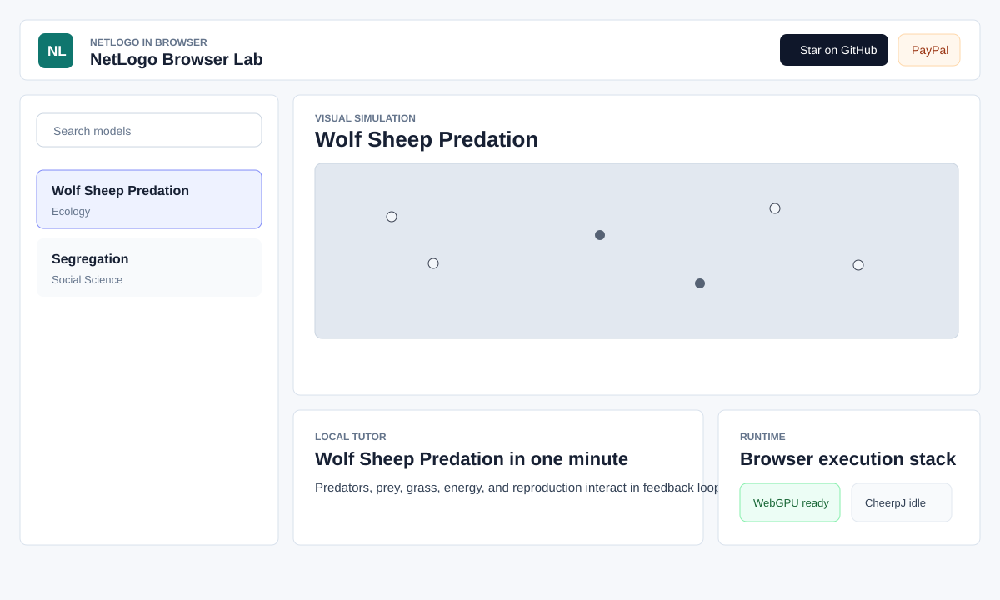
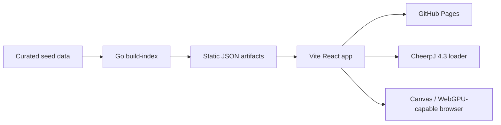

# NetLogo Browser Lab

[](https://baditaflorin.github.io/netlogo-browser-lab/)
[](LICENSE)

Live site: https://baditaflorin.github.io/netlogo-browser-lab/

Repository: https://github.com/baditaflorin/netlogo-browser-lab

NetLogo Browser Lab makes classic agent-based models approachable from a static browser app: curated model cards, visual simulations, local explanations, WebGPU capability detection, and an on-demand CheerpJ runtime bridge without a Java install.



## Quickstart

```sh
npm install
make data
make dev
```

Run checks:

```sh
make test
make build
make smoke
```

Install local hooks:

```sh
make install-hooks
```

## Architecture



ADRs: docs/adr/

Deployment guide: docs/deploy.md

Data contract: docs/data.md

Privacy: docs/privacy.md
