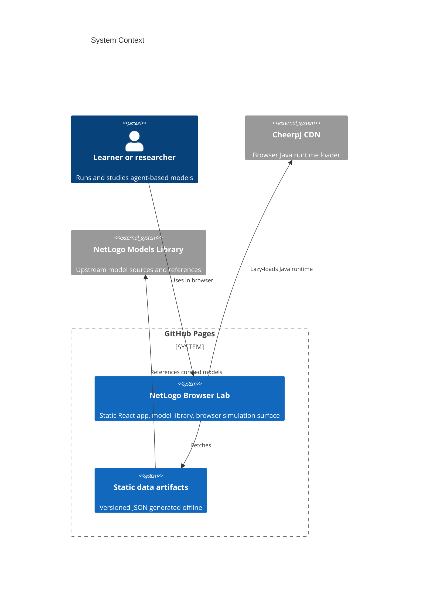
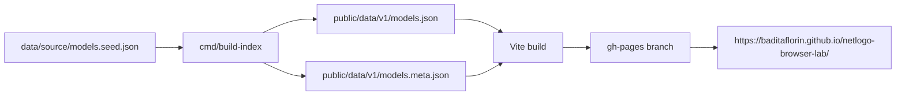

# Architecture

NetLogo Browser Lab is a static GitHub Pages app with an offline data pipeline.

```mermaid
C4Context
  title System Context
  Person(user, "Learner or researcher", "Runs and studies agent-based models")
  System_Boundary(pages, "GitHub Pages") {
    System(app, "NetLogo Browser Lab", "Static React app, model library, browser simulation surface")
    System(data, "Static data artifacts", "Versioned JSON generated offline")
  }
  System_Ext(cheerpj, "CheerpJ CDN", "Browser Java runtime loader")
  System_Ext(netlogo, "NetLogo Models Library", "Upstream model sources and references")
  Rel(user, app, "Uses in browser")
  Rel(app, data, "Fetches")
  Rel(app, cheerpj, "Lazy-loads Java runtime")
  Rel(data, netlogo, "References curated models")
```

```mermaid
flowchart LR
  seed["data/source/models.seed.json"] --> gen["cmd/build-index"]
  gen --> json["public/data/v1/models.json"]
  gen --> meta["public/data/v1/models.meta.json"]
  json --> vite["Vite build"]
  meta --> vite
  vite --> branch["gh-pages branch"]
  branch --> pages["https://baditaflorin.github.io/netlogo-browser-lab/"]
```
